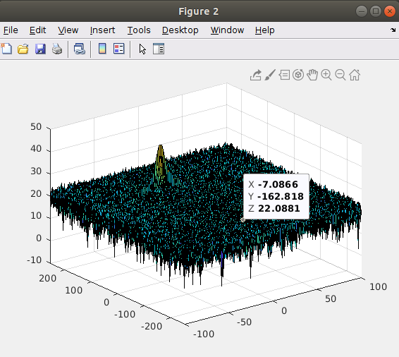
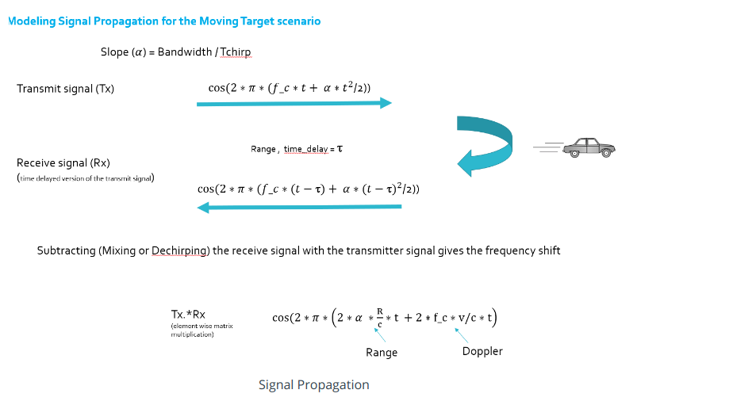
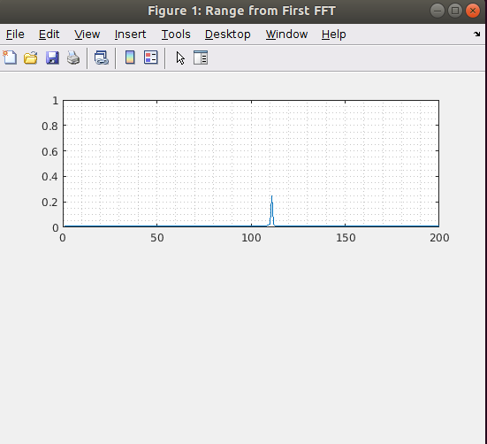

# SFND Radar Target Generation and Detection 

Course project for Udacity Sensor Fusion Engineer Nanodegree Program



This project simulates radar FMCW signal transmission and receipt upon target object reflection. Then we proceed to apply Fast Fourier transformation to the received beat frequency signal to extract target object range and velocity, particuly CFAR is used to filter detection noise.

Below are a high level introduction on major components of this project.

## FMCW Waveform Design

Simulated radar system requirement is as below,

```

%% Radar Specifications 
%%%%%%%%%%%%%%%%%%%%%%%%%%%
% Frequency of operation = 77GHz
% Max Range = 200m
% Range Resolution = 1 m
% Max Velocity = 100 m/s
%%%%%%%%%%%%%%%%%%%%%%%%%%%
```

As a result, we can derive relevant radar spec like Bandwidth, chrip time, and slope

```
delta_r = 1; %range resolution
range_max = 200; %max range
c = 3 * 10 ^ 8;  % speed fo light in meter/sec
B =  c / (2 * delta_r); %Bandwidth
Tchirp = 5.5 * (range_max * 2 /c); %chirp time
slope = B/Tchirp; %slope of the chirp
```

Calcuated slope of the chirp is `2.045454545454545e+13`


## Simulation Loop

In total, we defined 128 chirps, and each chirp is sampled 1024 times. At each time stamp of 1024*128, we simulated target vehicle movement and the resultant FMCW beat signal.

The simulated target vehicle's range is 110, and velociy is -20.

```
target_position = 110;
target_velocity = -20;
```

The match formular for simulated transmitted, received, and mixed signal are as below.




## Range FFT (1st FFT)

Using matlab API, range FFT is applied on the beat signal, and the range of the target vehicle is correctly extracted, around 110.



## 2D CFAR

Again using matlab API, 2dfft is applied to the mixed signal. and then 2D CFAR is applied to filter noise in the 2d fft result, and help us pick out the target signal.

In line with our expectations for CFAR processing, the signal's range is about 110, and its velocity is about -20.


### 2D CFAR process

The steps for 2D CFAR:

1. Determine relevant elements for the sliding window, including Tr, Td. Gr, Gd, and also thresholding offset.
2. Slide the Cell Under Test (CUT) across the complete cell matrix, except the edge area where test cells can't find corresponding training cells and guard cells.
3. Select the grid that includes the training, guard and test cells. Grid Size = (2Tr+2Gr+1)(2Td+2Gd+1), the total number of cells in the guard region and cell under test. (2Gr+1)(2Gd+1).This gives the Training Cells : (2Tr+2Gr+1)(2Td+2Gd+1) - (2Gr+1)(2Gd+1)
4. Obtain the noise across all the training cells.
5. Calcuate the threshold by adding up thresholding offset and the noise in step 4
6. Determine if Cell Under Test is signal or noise 

 
### Selection of Training, Guard cells and offset.

Below is the final design for training, guard cells and offset.

```
Tr = 16
Gr = 8
Td = 8
Gd = 4
offset = 15

```

Training and guard cells size, and thresholding offset are primally determined by trails and errors, by seeing which combinations help us extract more accurate target range and velocity. Initial offset value is selected by looking at the original 2dfft result, from there we can see the signal db is aroud 40, while the noise is about 20, so the gap is about 20.

### Suppression the non-thresholded cells at the edges
 
Around the edge area of 2d fft block, we are not able to perform CFAR. The handling is quite straightforward, we simply set those cells as zero.

## Refelction


A few takeaway for this project.

1. Range fft is performed on the mixed signal (beat frequency), and that's why it can directly obtain range information from the signal. Originally I thought it is applied on both transimitted and recieved signal, and couldn't figure how 1st FFT can get the range directly. There was a satisfying Aha moment once I realized this :)
2. 2D CFAR is an interesting idea, and is very similar to adaptive thresholding in image processing. I wonder how sensitive CFAR result is depedent on the sliding window parameters, and thresholding offset design in real radar signal processing project.
3. Understanding about Doppler effect: the received signal will have larger frequency when the target object is moving towards the radar, and will have smaller frequency when the target object is moving away from the radar. We can measure target velocity via the frequency change.


  

